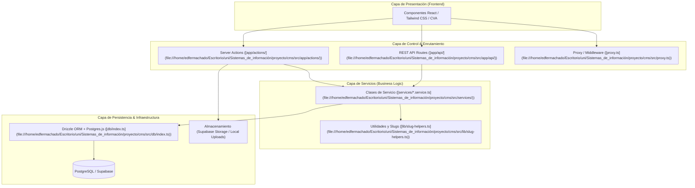
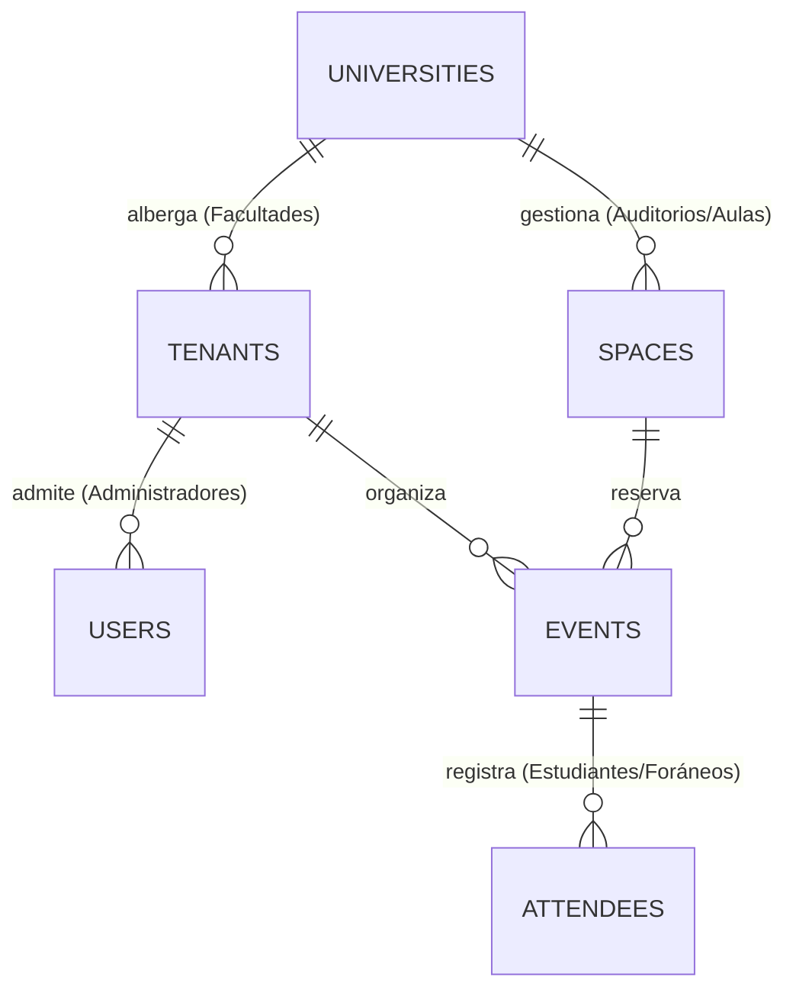

# Reporte de Auditoría Técnica: Arquitectura, Integridad, Escalabilidad y Matriz de Riesgos

**Proyecto:** CMS UniEvents (Sistema de Gestión de Eventos Universitarios Multi-Inquilino)  
**Fecha de Auditoría:** 25 de Julio de 2026  
**Evaluación General:** El sistema presenta una arquitectura moderna y estructurada fundamentada en principios de *Clean Architecture* sobre el ecosistema **Next.js 16 (App Router)** y **PostgreSQL**. A continuación se detalla el análisis integral de su estado actual.

---

## 1. Arquitectura Usada y Stack Tecnológico

El proyecto está diseñado bajo un patrón de **Arquitectura Multicapa (Layered / Clean Architecture)**, con una separación clara entre la interfaz de usuario, la capa de control (rutas y acciones de servidor), y la capa de lógica de negocio o servicios.

### 1.1 Modelo Multi-Inquilino (Multi-Tenant RBAC)
El sistema estructura los datos mediante un modelo jerárquico que permite compartir recursos físicos entre distintas entidades académicas:

- **Core Framework:** **Next.js 16** (App Router) aprovechando Server Components, Server Actions y la API Route Handler.
- **ORM & Base de Datos:** **Drizzle ORM** (`drizzle-orm`) combinando tipado estricto de TypeScript con un motor SQL ultraligero (`postgres.js`). El esquema se encuentra centralizado en [schema.ts](file:///home/edfermachado/Escritorio/uni/Sistemas_de_información/proyecto/cms/src/db/schema.ts).
- **Autenticación & Seguridad:** Gestión stateless con **JWT (jose)** en cookies HTTP-only securizadas ([auth.ts](file:///home/edfermachado/Escritorio/uni/Sistemas_de_información/proyecto/cms/src/lib/auth.ts)) y hash paramétrico con **bcryptjs** (costo 10).

---

## 2. Evaluación de la Integridad del Sistema

La integridad de los datos y de la lógica transaccional muestra un alto nivel de madurez en varias capas clave:

> [!NOTE]
> **Prevención Anti-Suplantación en Registro de Eventos:**  
> Al procesar el registro de un asistente en una Server Action ([attendees.actions.ts:L29-L31](file:///home/edfermachado/Escritorio/uni/Sistemas_de_información/proyecto/cms/src/app/actions/attendees.actions.ts#L29-L31)), el sistema no confía en los datos de correo o ID enviados desde el formulario cliente (`FormData`). En su lugar, extrae directamente el `email` y `userId` del token JWT verificado en la sesión del servidor, anulando vulnerabilidades por manipulación de peticiones HTTP (IDOR / Impersonation).

1. **Integridad Referencial y Restricciones SQL:**
   - Todas las relaciones jerárquicas (universidades, facultades, espacios, eventos y asistentes) poseen claves foráneas e indexación explícita en columnas críticas como `tenantId`, `status`, `visibility` y `date` ([schema.ts:L83-L87](file:///home/edfermachado/Escritorio/uni/Sistemas_de_información/proyecto/cms/src/db/schema.ts#L83-L87)).
   - Uso de enumeraciones estrictas en PostgreSQL (`pgEnum`) para estados de registro (`registrado`, `confirmado`, `pago_pendiente`), roles y niveles de organizador, impidiendo inserción de estados no válidos.
2. **Inmutabilidad y Tokens Únicos:**
   - La emisión de entradas (tickets) asigna un identificador UUID v4 aleatorio y único (`ticketToken`) a cada asistente en [schema.ts:L99](file:///home/edfermachado/Escritorio/uni/Sistemas_de_información/proyecto/cms/src/db/schema.ts#L99), impidiendo la falsificación o adivinación secuencial de entradas durante la validación por escáner QR.
3. **Resguardo de Integridad en Limpieza (Bottom-Up Deletion):**
   - El endpoint de mantenimiento y limpieza ([route.ts:L17-L50](file:///home/edfermachado/Escritorio/uni/Sistemas_de_información/proyecto/cms/src/app/api/admin/cleanup/route.ts#L17-L50)) respeta escrupulosamente la jerarquía referencial eliminando desde los registros hijos (logs de escaneo y asistentes) hacia los registros padres, preservando a su vez la cuenta raíz del `superadmin`.

---

## 3. Análisis de Escalabilidad

El diseño general del sistema está preparado para escalar en entornos *cloud-native* y *serverless*, aunque presenta puntos sensibles en el manejo de archivos concurrentes.

| Aspecto | Estado Actual | Impacto en Escalabilidad |
| :--- | :--- | :--- |
| **Sesiones Stateless** | **Excelente** | Al utilizar tokens JWT firmados y verificados criptográficamente sin almacenamiento de sesión en memoria (como Redis o base de datos por petición), el sistema permite un escalado horizontal transparente entre múltiples instancias en contenedores o funciones Edge. |
| **Compatibilidad con Poolers (pgBouncer)** | **Sobresaliente** | En [db/index.ts:L12](file:///home/edfermachado/Escritorio/uni/Sistemas_de_información/proyecto/cms/src/db/index.ts#L12), se configura explícitamente `prepare: false` en el cliente de `postgres.js`. Esto es una optimización crítica para funcionar tras un *Transaction Pooler* (como Supabase en el puerto 6543 o AWS RDS Proxy) sin agotar conexiones ni generar conflictos de sentencias preparadas. |
| **Almacenamiento de Comprobantes de Pago** | **Riesgo Medio** | El sistema intenta subir las capturas de pago a Supabase Storage, pero tiene un fallback a almacenamiento en disco local (`public/uploads/payments/`) en [attendees.actions.ts:L45-L60](file:///home/edfermachado/Escritorio/uni/Sistemas_de_información/proyecto/cms/src/app/actions/attendees.actions.ts#L45-L60). En arquitecturas escaladas horizontalmente (ej. Vercel, AWS ECS, Docker en clúster), el disco local es efímero y no se comparte entre nodos, lo que provocará pérdida de comprobantes en producción. |
| **Consultas de Colisión de Eventos** | **Mejorable** | La detección de solapamiento de horarios en [events.service.ts:L49-L67](file:///home/edfermachado/Escritorio/uni/Sistemas_de_información/proyecto/cms/src/services/events.service.ts#L49-L67) consulta los eventos de un rango de fechas y realiza la iteración de cálculo de colisión en memoria (espacio JavaScript). Con un volumen masivo de eventos, esta operación consumirá ciclos excesivos de CPU en Node.js. |

---

## 4. Uso de Buenas Prácticas

El proyecto refleja un alineamiento notable con estándares de ingeniería de software modernos:

- **Separación de Incumbencias (Clean Architecture):** Los controladores (Server Actions y Route Handlers) delegan toda la lógica a clases de servicio especializadas (`EventsService`, `AttendeesService`, `TenantsService`). Esto facilita las pruebas unitarias y el mantenimiento.
- **Optimización Automática de Activos (Image Processing):** Cuando se reciben imágenes o capturas de pantalla, se utiliza la librería `sharp` para redimensionar (máximo 800px) y comprimir a formato **WebP** con calidad del 80%, ahorrando ancho de banda y almacenamiento considerablemente.
- **Slugs Amigables para SEO:** Implementación de un motor de generación de slugs dinámico que verifica colisiones numéricas ([slug-helpers.ts](file:///home/edfermachado/Escritorio/uni/Sistemas_de_información/proyecto/cms/src/lib/slug-helpers.ts)), garantizando URLs limpias y significadas para buscadores e indexación web (`/events/congreso-tecnologia-2026`).
- **Control de Permisos de Capa Doble:** Validación tanto en el borde (Edge Proxy en [proxy.ts](file:///home/edfermachado/Escritorio/uni/Sistemas_de_información/proyecto/cms/src/proxy.ts)) para accesos a `/faculty-admin`, como en el renderizado del servidor dentro de los Server Components ([layout.tsx:L9](file:///home/edfermachado/Escritorio/uni/Sistemas_de_información/proyecto/cms/src/app/admin/%28dashboard%29/layout.tsx#L9)) para el panel del superadministrador.

---

## 5. Posibles Fallas y Matriz de Riesgos Críticos

A pesar de la solidez estructural, se identifican vulnerabilidades transaccionales y arquitectónicas que deben abordarse antes de operar en escenarios de alta demanda o concurrencia.

> [!WARNING]
> **Riesgo Crítico de Concurrencia (Race Condition / TOCTOU) en Control de Aforo:**  
> En el registro de asistentes ([attendees.service.ts:L24-L32](file:///home/edfermachado/Escritorio/uni/Sistemas_de_información/proyecto/cms/src/services/attendees.service.ts#L24-L32)), el sistema consulta el número total de inscritos mediante un `SELECT count(*)` y lo compara en memoria con la capacidad máxima (`currentCount >= capacity`) antes de ejecutar el `db.insert()`.
> 
> **Consecuencia:** Si dos o más usuarios solicitan el último cupo en el mismo milisegundo, ambos pasarán la validación de conteo y se registrarán en la base de datos, provocando un sobrecupo o sobreventa (*Sold-out bypass*).

### Matriz Detallada de Vulnerabilidades y Mitigaciones

| Nivel | Componente | Descripción de la Falla / Riesgo | Solución Recomendada |
| :---: | :--- | :--- | :--- |
| **ALTA** | `AttendeesService.registerAttendee` | **Condición de Carrera en Aforo (Overbooking):** Falla TOCTOU (*Time-of-Check to Time-of-Use*) al verificar capacidad en memoria sin aislamiento transaccional SQL ni bloqueo de fila. | Envolver la operación en una transacción `db.transaction()` utilizando bloqueo pesimista (`SELECT ... FOR UPDATE`) o hacer valer un *constraint* transaccional a nivel de motor de base de datos. |
| **ALTA** | `EventsService.checkSpaceConflict` | **Colisión Horaria Concurrente:** Dos administradores agendando un evento en el mismo espacio y horario de manera concurrente evadirán la validación en memoria y generarán solapamiento de reservas en el auditorio. | Implementar restricciones de exclusión en PostgreSQL (`EXCLUDE USING gist`) para evitar solapamientos de rangos de fecha/hora (`tsrange`) en un mismo `space_id` a nivel de base de datos. |
| **MEDIA** | `src/app/actions/auth.ts` | **Ausencia de Rate Limiting (Ataques de Fuerza Bruta):** Los endpoints y Server Actions de inicio de sesión (`loginUser`, `loginFacultyAdmin`) y registro masivo carecen de limitación de tasa por IP o usuario. | Integrar un middleware o limitador de tasa (*Rate Limiter* como `@upstash/ratelimit` o en Cloudflare/Vercel) para frenar intentos repetidos de autenticación y prevenir saturación DoS. |
| **MEDIA** | `attendees.actions.ts` | **Persistencia Efímera en Disco Local:** El almacenamiento de rescate (*fallback*) escribe archivos en `public/uploads/payments/`. En despliegues multi-servidor o contenedores sin volumen persitente, las imágenes no serán accesibles entre instancias. | Eliminar el fallback al disco local en entornos de producción y asegurar una alta disponibilidad en la subida hacia **Supabase Storage** o un bucket S3 dedicado. |
| **BAJA** | `src/app/actions/*.ts` | **Manejo de Excepciones Expuesto:** La captura de errores mediante `error.message` puede en ocasiones filtrar mensajes internos del motor SQL o stack traces en caso de excepciones no controladas. | Mapear los errores del servidor a un conjunto tipado y amigable de mensajes públicos de error, enviando los detalles técnicos exclusivamente a un servicio de monitoreo (ej. Sentry). |

> [!TIP]
> **Recomendación Inmediata de Mejora:**  
> Se sugiere priorizar la refactorización del método `registerAttendee` en [attendees.service.ts](file:///home/edfermachado/Escritorio/uni/Sistemas_de_información/proyecto/cms/src/services/attendees.service.ts) para incluir transacciones atómicas de Drizzle. Esto eliminará de raíz la vulnerabilidad de sobreventa antes del despliegue masivo en facultades universitarias.
